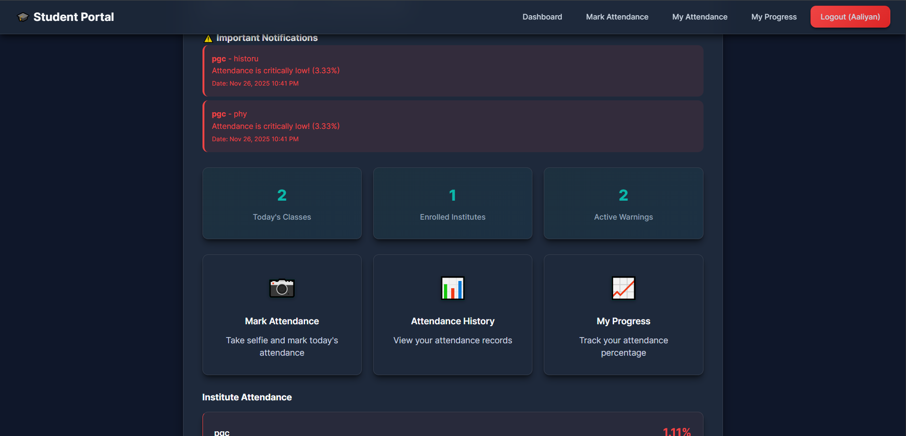

# 📚 Student Attendance Tracker (PHP + MySQL)

A lightweight attendance-tracking app built with classic PHP and MySQL — simple, reliable, and crafted in the spirit of how things have always been done right. Students can register, add their institutes and subjects, and mark their daily presence with a timestamped selfie. The system quietly handles all the math: attendance percentages, warnings for low attendance, and clean visual reports.

---

## 📸 Screenshots

### 🔸 Dashboard


### 🔸 Mark Attendance Page
*(Add image when ready)*

### 🔸 Reports & Charts
*(Add image when ready)*

---

## 🔹 Core Features

- **Student registration & login**
- **Add/manage institutes and subjects**
- **Mark attendance with selfie proof**
- **Auto-calculated attendance percentages**
- **Custom thresholds for low-attendance warnings**
- **Attendance history with graphical reports**
- **WhatsApp-ready sharing for summaries**

---

## 🔹 Tech Stack

- **Frontend:** HTML, CSS, JavaScript  
- **Backend:** PHP (Procedural)  
- **Database:** MySQL  
- **Charts:** Chart.js  

---

## 🔹 What This Project Demonstrates

- Clean & structured **CRUD operations**
- Secure **authentication** using hashed passwords and sessions
- Practical **file uploads** (selfie-based attendance system)
- Well-designed **relational database schema**
- A polished, portfolio-ready **full-stack workflow**

---

## 🔧 Installation & Setup

1. Clone the repository  
   ```bash
   git clone https://github.com/AaliyanUstad/STUDENT-ATTENDENCE-APP.git
